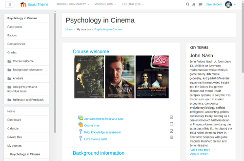

About this theme
================

Release Notes
-------------

Version 2016111700 (ALPHA)

This theme has been created by University of Namur ICTE Unit ("Cellule TICE")

<!---->

* package   theme_mwar
* authors   Jean-Roch Meurisse
* copyright 2016 - Cellule TICE - Unversite de Namur
* license   http://www.gnu.org/copyleft/gpl.html GNU GPL v3 or later

This theme has been created with the help of:
Laurence Dumortier, Eric Willems and Gaëtan Botty

This theme is based on the Moodle Boost core theme

Moodle versions
---------------
This theme works on Moodle 3.2 and newer
